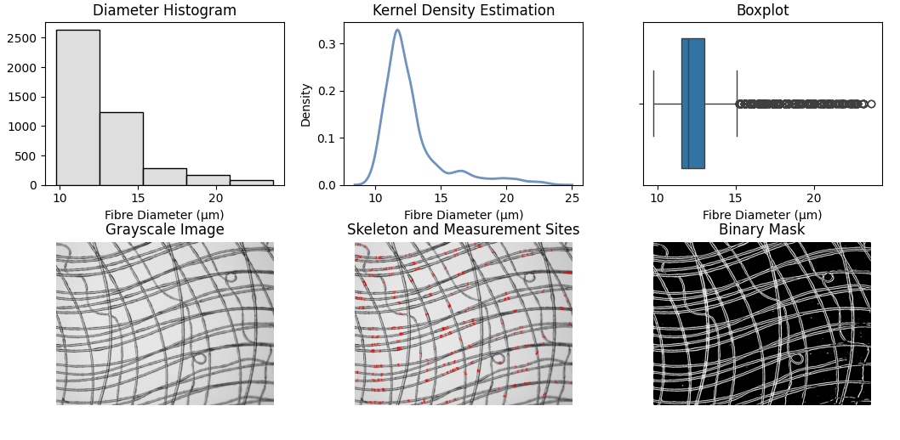

# FibreScope - Fibre Scaffold Analysis Software

Scaffold analysis software designed for fibre diameter and pore size measurement based on traditional CV solutions. Fibre diameter is measured via continuous sampling along the normal direction of fibre edges, using a per-sample edge-pairing method that combines skeleton-to-skeleton distance (d2) and skeleton-to-edge-boundary distance (d1) to reconstruct the true fibre diameter. Input images are processed and binarised for diameter and area measurement. All results are originally in pixels and need to be converted to real-world length units via the scale factor.

> This project is still under active development and will be updated in the near future.

## Example

Fibre diameter measurement result:



Pore size measurement result:


## Usage

1. Import an image via **File → Open Image** or `Ctrl + I`.
2. Choose an analysis mode under **Options**: `Fibre Measure` or `Pore Measure`.
3. Adjust parameters in the sidebar if needed, then click **Set** to apply.
4. Run analysis via **Run** or `F5`.
5. Save the result image via **File → Save Result** or `Ctrl + S`.

### Build
```bash
mkdir build
cd build
cmake ..
cmake --build . --config Release
```

### Parameters

All parameters can be adjusted in the sidebar and are persisted across sessions.

| Parameter | Default | Description |
|---|---|---|
| **Scale Factor** | 1.25 | Pixel-to-real-length ratio; depends on instrument setup. |
| **JER** | 40 | Junction Exclusion Radius — exclusion zone around fibre junctions and intersections to improve measurement accuracy. |
| **Rate** | 0.5 | Sampling rate relative to total skeleton points. 0.1 = fast, 1.0 = full. |
| **MSD** | 50 | Maximum Search Distance along the normal direction in pixels. Recommended: 1.5–2× expected fibre diameter. |
| **Smoothing** | 2.0 | Gaussian sigma used in Hessian ridge enhancement. |
| **Threshold** | 0.15 | Normalised response threshold for ridge mask extraction. |

## API Usage

The core modules can be imported directly from `core/`.

### Diameter Measurement

```python
from fibre_measure import measure
import numpy as np

true_diameters, pairs, edge_mask, fibre_dict = measure(
    r"example/image",
    sample_rate=0.5,
    max_search_distance=50,
    jer=40,
    scale_factor=1.25,
    sigma=2,
    threshold=0.15,
)
average_diameter = np.average(true_diameters)
```

### Pore Size Measurement

```python
from pore_measure import measure
import numpy as np

area_arr, circularity_arr, solidity_arr, img_path = measure(r"example/image")
average_area = np.average(area_arr)
```
